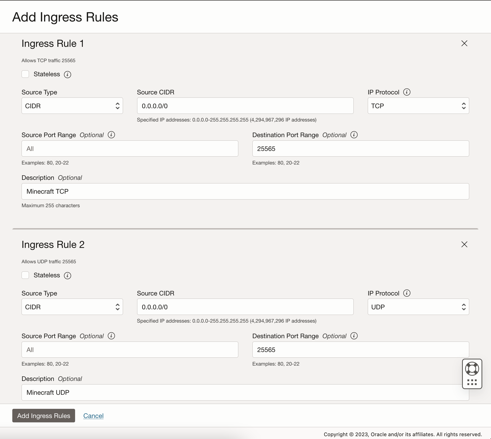

## Setup instructions for Minecraft on Oracle Cloud VPS.

`#` = executed as superuser (or using `sudo`) \
`$` = regular prompt

0. ### Install java if it isn't yet:

```
# apt install openjdk-17-jre
```

1. ### Create a new account:

```
# useradd -m <username>
```

2. ### **enable-linger** (otherwise end of SSH session will stop the server):

```
# loginctl enable-linger <username>
```

3. ### Switch into the new user

```
# su <username>
```

4. ### Get the user's ID:

```
$ id
uid=<num>(username) gid=<num>(group) groups=<num>(group)
```

5. ### Append lines to `~/.bashrc`:

```bash
export XDG_RUNTIME_DIR=/run/user/<num>
export DBUS_SESSION_BUS_ADDRESS=<num>
```
This is required as otherwise systemd will fail when we want to setup services as we aren't logged in normally, we are using `su`.

After doing this, log out and back in again to apply it to the shell. (`Ctrl+D` to exit)

6. ### Create the server and test it:

```
$ mkdir ~/server
$ cd ~/server
$ wget <server jar url>
$ java -jar ./<server>.jar
... output ...
```
Setup the server as you want it here. If modded, download the mods to the `mods` folder before running the server using `wget`.

7. ### Create the systemd service:

First create the directory for user services:
```
$ mkdir -p ~/.config/systemd/user
```

Then create the file `~/.config/systemd/user/minecraft.service`:
```ini
[Unit]
Description=Minecraft Server # Set your description.
After=network.target # Wait for network before we run.

[Service]
Type=simple
WorkingDirectory=/home/<user>/server # Directory server is located in.

Sockets=minecraft.socket # The socket is our way of communicating with the server console, using 'mcmd' later.
StandardInput=socket
StandardOutput=journal
StandardError=journal

ExecStart=/bin/sh -c "./start.sh" # local path to your start script in the server directory.
ExecStop=/bin/sh -c "echo stop > /tmp/minecraft_<user>" # switch <user> for the username of this account.
Restart=on-failure
RestartSec=30s

KillSignal=SIGCONT # This actually says to systemd "to kill this process, tell it to continue running. We do this as minecraft handles shutdown via the 'stop' command and won't shut down right if we kill it.

[Install]
WantedBy=default.target
```
Adjust this to your needs and save.

Next, create the socket at `~/.config/systemd/user/minecraft.socket`:
```ini
[Unit]
BindsTo=minecraft.service # this may be different if you changed the service name.

[Socket]
ListenFIFO=/tmp/minecraft_<user> # fill this in the same as before
Service=minecraft.service
SocketUser=<user> # fill this in with the user we are on
SocketGroup=<user> # fill this in with the user we are on
RemoveOnStop=true
SocketMode=0600
```

8. ### Test the service:

Firstly we need to reload the systemd daemon for it to pick up the new service:
```
$ systemctl --user daemon-reload
```

Now, run the new service and socket.
```
$ systemctl --user enable --now minecraft.{service,socket}
```

Check it starts up ok:
```
$ journalctl --user -f -u minecraft.service
... Service Output or Error ...
```
(exit with `Ctrl+C`)

9. ### Add log alias & console access:

Append lines to `~/.bashrc`:
```bash
export PATH="$HOME/.local/bin:$PATH" # Add '~/.local/bin' to our path so we can put our own executables there.

alias mlog="journalctl --user -f -u minecraft.service" # same command as earlier, just lets us run it by typing 'mlog'.
```

Create the directory `~/.local/bin`.

Create `~/.local/bin/mcmd`:
```bash
#! /bin/bash
echo $@ > /tmp/minecraft_<user>
```
Make it executable:
```
$ chmod +x ~/.local/bin/mcmd
```

Relaunch the shell again and try both `mlog` and `mcmd`, e.g.
```
$ mcmd say hello!
```
```
$ mlog
... Output ...
[timestamp info] [Server] hello!
```


10. ### Open the port in `iptables`:

Edit `/etc/iptables/rules.v4` as sudo:
```ini
# ...
# After this line, add your rules
-A INPUT -p tcp -m state --state NEW -m tcp --dport 22 -j ACCEPT
# Add your lines here:
-A INPUT -p tcp -m tcp --dport <port> -j ACCEPT
-A INPUT -p udp -m udp --dport <port> -j ACCEPT
# Replace <port> with your port (probably 25565)
```

Reboot to apply the changes (requires root)
```
# reboot
```

11. ### Open the port in Oracle Cloud:

The name of your vcn will be slightly different. \
    1.  \
    2.  \
    3.  \
    4.  \
    5.  \
    6.  \
    7.  (Change the destination port if not 25565.)